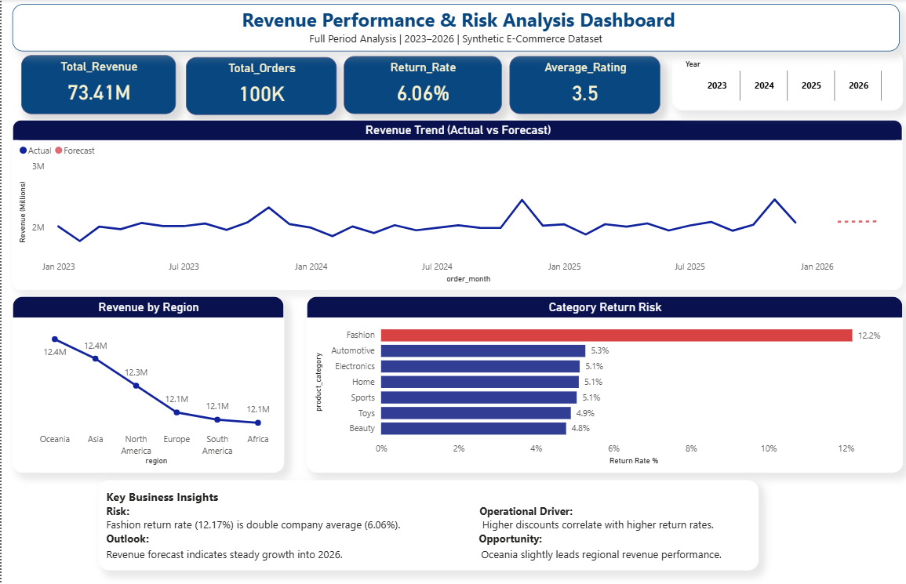
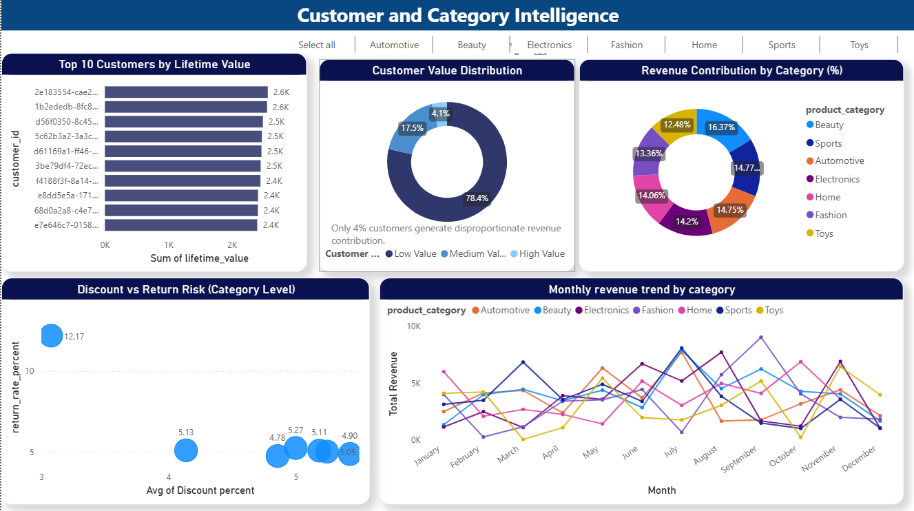

# 📊 E-Commerce Revenue & Risk Intelligence Dashboard

## Overview
A multi-page Business Intelligence dashboard built using a synthetic e-commerce dataset (2023–2026) to analyze revenue performance, return risk, customer segmentation, and category demand trends.

This project simulates real-world executive reporting and operational analytics using Power BI.
Designed an end-to-end E-commerce Revenue Intelligence System using SQL (data modeling), Python (EDA & validation), and Power BI (interactive BI reporting)

## Dashboard Structure

### Page 1 - Revenue Performance & Risk Analysis
- KPI Overview (Revenue, Orders, Return Rate, Rating)
- Actual vs Forecast Revenue Trend
- Revenue by Region
- Category Return Risk Analysis
- Key Business Insights Panel

### Page 2 - Customer & Category Intelligence
- Top 10 Customers by Lifetime Value
- Customer Value Segmentation
- Revenue Contribution by Category (%)
- Discount vs Return Risk (Scatter Analysis)
- Monthly Revenue Trend by Category

---

## Key Insights

- Fashion category shows significantly higher return risk than company average.
- Higher discount levels correlate with increased return rates.
- Revenue trend indicates steady growth into 2026.
- A small percentage of customers contribute disproportionately to total revenue.

---

## Tools & Techniques Used

- Power BI
- Data Modeling (Fact & Dimension tables)
- DAX Measures
- Time Intelligence
- Forecasting
- Interactive Filtering & Slicers

---

## Dashboard Preview

### Executive Overview

### Customer & Category Intelligence

---

## Business Impact

This dashboard enables leadership to:
- Monitor performance and growth
- Identify high-risk product categories
- Optimize discount strategy
- Understand customer value distribution
- Make data-driven pricing and inventory decisions
