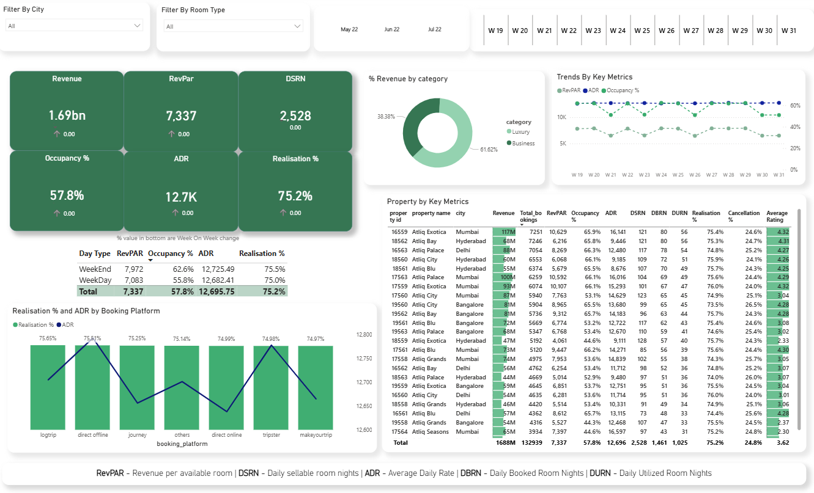

# 🏨 Hospitality Revenue Analytics Dashboard (Power BI)

## Overview
Interactive Power BI dashboard analyzing hotel performance and revenue metrics to support data-driven decisions in the hospitality domain.

---

## Key Metrics
- Revenue
- RevPAR (Revenue per Available Room)
- ADR (Average Daily Rate)
- Occupancy %
- DSRN (Daily Sellable Room Nights)
- Realisation %

---

## Key Insights
- Revenue and occupancy trends across weeks
- Performance comparison by city and room type
- Revenue contribution by category (Luxury vs Business)
- Platform-wise booking performance
- Property-level performance analysis

---

## Tools Used
- Power BI  
- Power Query  
- DAX  

---

## Dashboard Preview

---

## Business Impact
Helps hospitality teams monitor revenue performance, optimize pricing strategies, and improve occupancy and booking efficiency.
